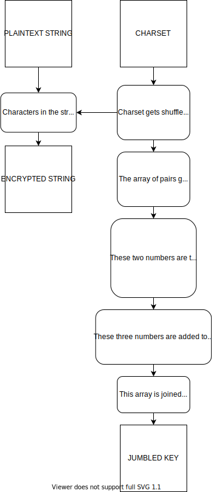

# phase-key

phase-key is an encrypter built with ruby. It's more of a learning project so it isn't perfect but it works :)

## How it works

Here is a rough diagram about how the encryption works.



## Usage and Installation

```
git clone https://github.com/pharmac1st/phase-key.git
bundle
cd phase-key
```

## Usage

```
ruby phase_key.rb encrypt -s "hello world" -wk ./key.txt -ws ./string.txt
ruby phase_key.rb decrypt -f ./string.txt -k ./key.txt
```

## Manual

```
phase_key.rb [--help] <command>
	[--help]   prints the man page
	<command>  One of: encrypt, decrypt.  (default: encrypt)

	encrypt [-s/--s <string>] [-f/--file <path_to_file>] [-ch/--charset <string/path_to_file>] [-wk/--writekey <path_to_dest>] [-ws/--writestr <path_to_dest>]
		Encrypts a string or a file with phase key

		[-s/--s <string>]                      the string you wish to encrypt (required)
		[-f/--file <path_to_file>]             the file you wish to encrypt
		[-ch/--charset <string/path_to_file>]  the string form of the charset you wish to encrypt with
		[-wk/--writekey <path_to_dest>]        the file you wish to write the key too.
		[-ws/--writestr <path_to_dest>]        the file you wish to write the encrypted string too.

	decrypt [-s/--string <path_to_file>] [-f/--file <path_to_file>] [-k/--key <path_to_key_file/string>] [-ch/--charset <string/path_to_file>] [-ws/--writestr <path_to_dest>]
		Encrypts a string or a file with phase key

		[-s/--string <path_to_file>]           the file you wish to decrypt
		[-f/--file <path_to_file>]             the file you wish to encrypt
		[-k/--key <path_to_key_file/string>]   the key you wish to decrypt with
		[-ch/--charset <string/path_to_file>]  the string form of the charset you wish to decrypt with
		[-ws/--writestr <path_to_dest>]        the file you wish to write the decrypted string too.
```

### Warning/Disclaimer

This is a learning project, define a charset and use common sense if using for real world purposes. Longer charsets are better.
